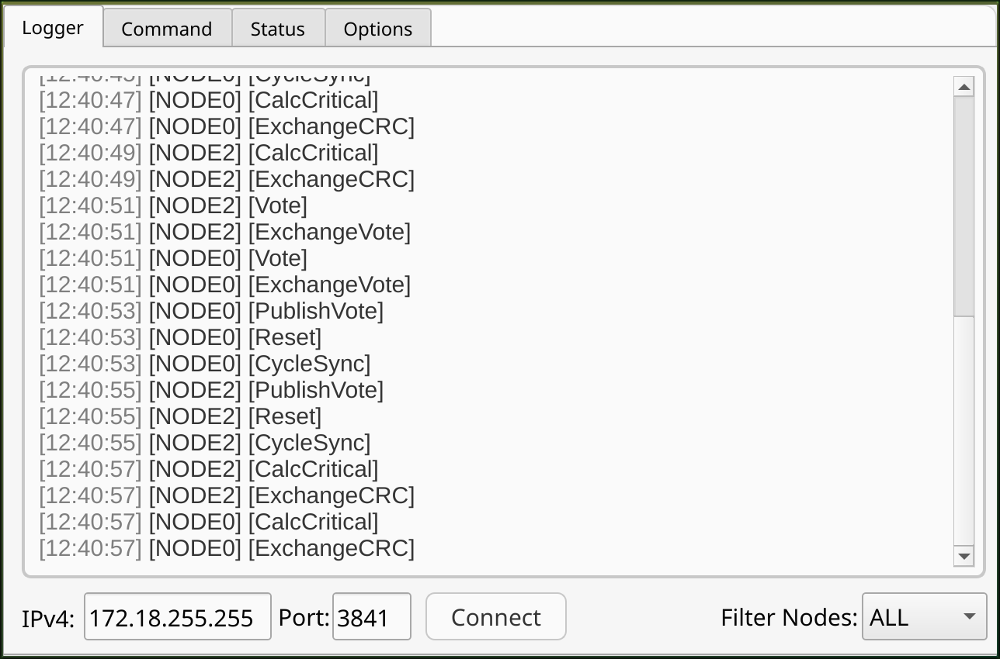
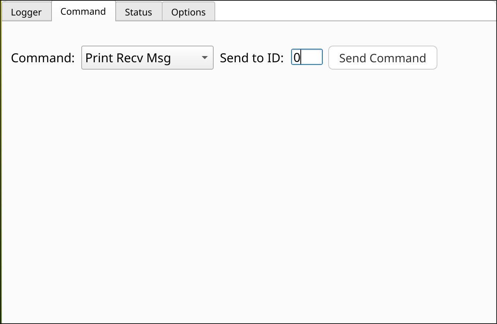
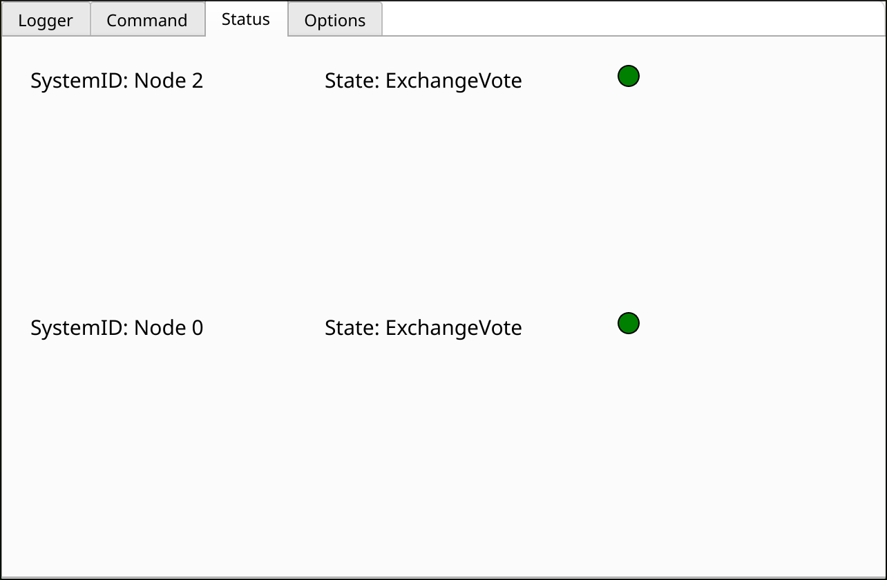
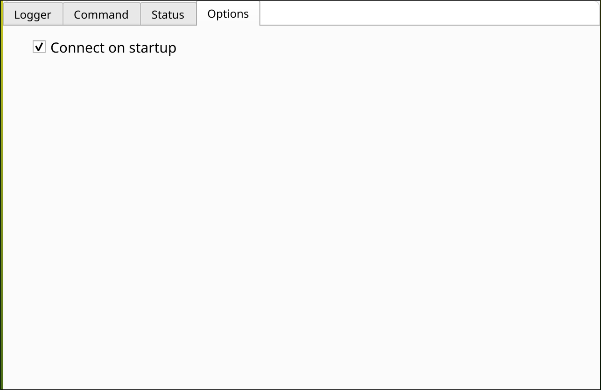

# Diagnose Tool for software-based fault tolerance

This GUI tool was created as a part of my master project,
its used for debugging the software-based fault tolerant systems
which can be created with my other repository: 
software-based-fault-tolerance

## Prerequisites
Python3: tested with version 3.14.3 under windows 10 and arch linux

## Setup & Run(Linux)
```console
cd to/project/dir
python3 -m venv .venv
source .venv/bin/activate.fish (replace activate.fish with whatever shell you are using)
pip install -r requirements.txt
python3 main.py
```

## Project Files
- main_window.py => Auto generated file from the Qt widget designer.
- main_window.ui => Generated project file from the Qt widget designer, 
                    if you want to extend the GUI or alter it this is the file which you need to open in the Qt widget designer.
- main.py => Main source file includes handlers and objects for control of the widgets
- utils/ => Directory containing all needed classes for parsing messages and receiving udp messages

## Project


The GUI includes four different tabs:
- Logger: Includes the logging window were logs are monitored and can be filtered.
- Command: Includes the ability to send commands to different nodes.
- Status: Includes the current nodes in the system and their respective state.
- Options: Includes options to configure the application (atm only includes auto connection on startup).

### Logging Tab
The logging tab includes the logging textbox, ipv4 and port textboxes, a node filter combobox and a connect button. The **ipv4** field should include the upd broadcast address were you want to send your master commands to (needs to be the same broadcast address as the one of the running nodes). Same for the **udp port** otherwise you won't be able to receive any messages from the running nodes. Since we listen an **all interfaces** for udp messages (0.0.0.0), we won't need a specific listening address.

### Command Tab

This tab give the ability to send preset commands to different nodes in the system, you have the freedom to send to any node ranging from id 0 to 255, so you should be aware to which of your running system nodes you want to send a command. At the moment the preset commands are:

- Print Recv Msg => Prints a logging message at the specifc node.
- Induce Voting Fault => Induces a Voting fault at the specific node.
- Induce CRC Fault => Induces a CRC fault at the specific node.

### Status Tab

Fetches the current nodes in the system and displays each node and it's respective state.

### Options Tab

Allows the user to set specific options for the application, at the moment only includes auto connection on app startup.